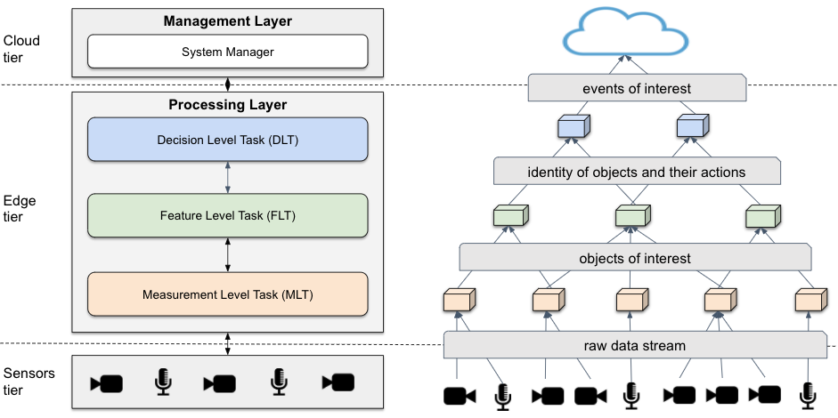

# Multilevel Information Distributed Processing Architecture (MELINDA)

This is my doctoral project to develop a platform for distributed video 
stream processing using edge devices. The following figure shows how we 
idealized this platform using a three-tier nodes organization.

