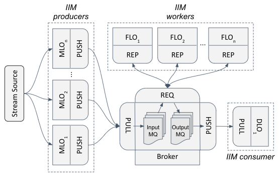

# Multilevel Information Distributed Processing Architecture (MELINDA)

This is my doctoral project to develop a platform for distributed video 
stream processing using edge devices. Figure 1 shows how we 
idealized this platform using a three-tier nodes organization.

Figure 1: MELINDA three-tier architecture.

MELINDA is a microservice architecture (MSA) encompassing a set of software
components to apply _Multilevel Information Fusion_ (MIF) and _Machine Learning_
(ML) in multimedia stream processing. MELINDA components implement a method 
to classify and create the processing  tasks according to the input data 
abstraction level. MELINDA also provides a decision mechanism to allocate 
adequate processing nodes to run each job with lower processing time.

Our load balance approach uses the pattern _producer_ -> _worker_ -> _consumer_
of messages queue. Figure 2 shows the workflow nodes organization. MLO nodes 
are the _image of interest message_ (IIM) producers, FLO nodes are the workers
and one DLO is the final consumer of the processing flow. Simultaneously, FLO 
nodes might be serving the same intelligence service to another workflow. MLO 
nodes are continually analyzing the video stream, processing each frame from 
the data source to detect the object of interest.

Figure 2: Workload distribution with load balance on worker (FLO) nodes..
